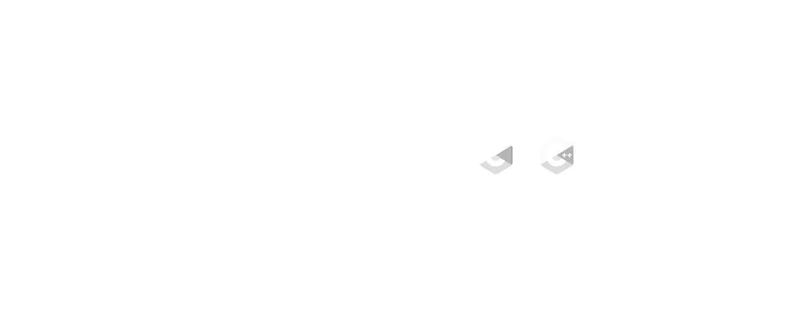
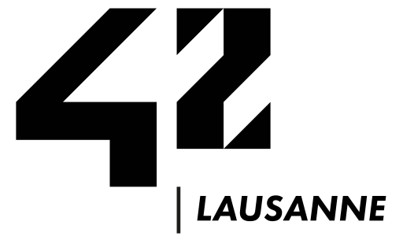
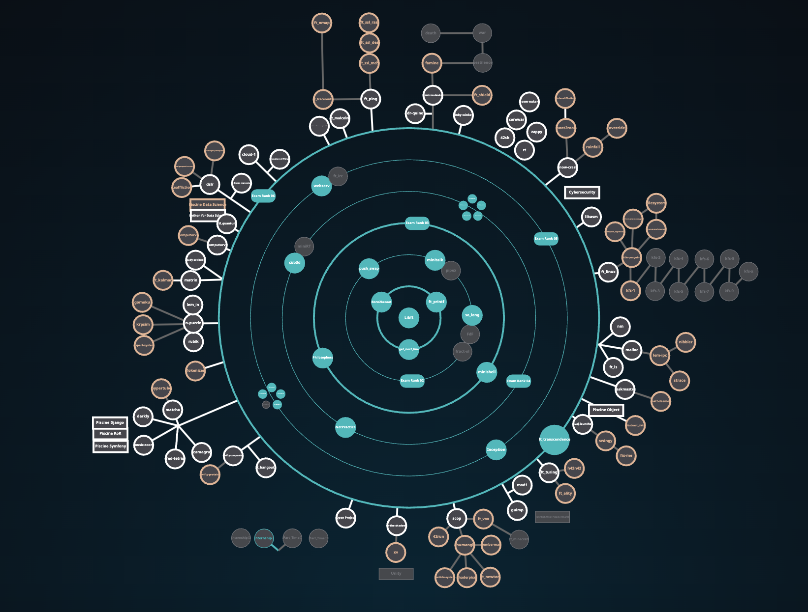

# Greetings, fellow tech enthusiasts, I’m Bima, or Tanguy!

I'm always looking for new ways to learn, collaborate, and create. 
Let's explore my work and see what we can build together!

Not so fast! I'll leave you with a brief summary of my current situation before going into more detail.

* 🎓 I'm still connected to the amazing [42 Lausanne School](https://42lausanne.ch/#temoignages) where learning never stops.
* 💻 Currently rocking React/Python at [Resilio](https://resilio-solutions.com).
* 🧑‍🌾 Farming side projects with [Widium](https://github.com/widium).
* 🔗 You can find my professional journey and connect with me on [Linkedin](https://www.linkedin.com/in/tanguy-pauvret/)
* 📧 Drop me a line at <a href="mailto:pauvret.tanguy@gmail.com">pauvret.tanguy@gmail.com</a>   — I'm always up for a chat about tech, startups, or any other fascinating subject!

## Side Projects Farm 🧑‍🌾

## Where I Come From
It has been a wild ride. With a background in Neurosciences, I took a sharp turn into tech thanks to [42 Lausanne School](https://42lausanne.ch/#temoignages), driven by an insatiable curiosity and a knack for problem-solving.

<table style="width: 75%; margin-left: auto; margin-right: auto;">
  <tr>
    <td>
      
    </td>
    <td>
      
    </td>
  </tr>
</table>

The school is like Hogwarts for developers—minus the magic wands, but with a lot more coding. Here's how this unique environment helped me evolve:
* At 42, I didn't just learn to code; I learned to think like an innovator and quickly find a solution to a problem.
* The diverse projects helped me discover my passion for full-stack development and the thrill of startup life.
* Working with a community of motivated peers taught me the value of teamwork and how to collaborate effectively, even remotely and under tight deadlines.

 

## Open source projects
- #### [42 Projects](https://github.com/Bima42/42-projects-overview)
- #### [Maze generator](https://github.com/Bima42/cub3d_map_generator) for [42 Cub3D project](https://github.com/Bima42/cub3d)
