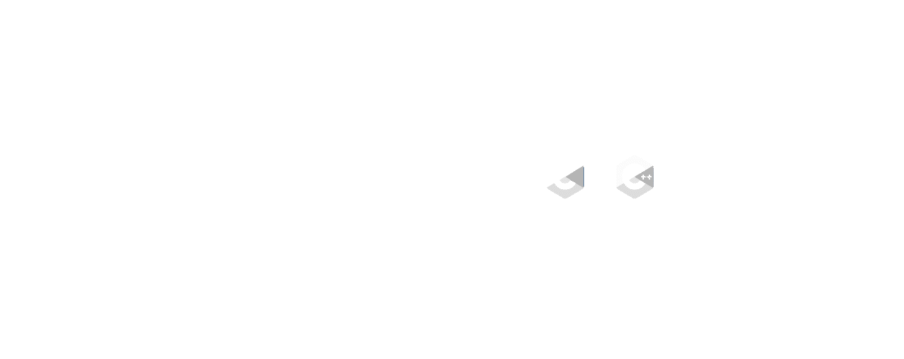
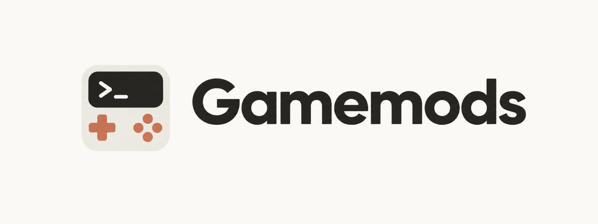
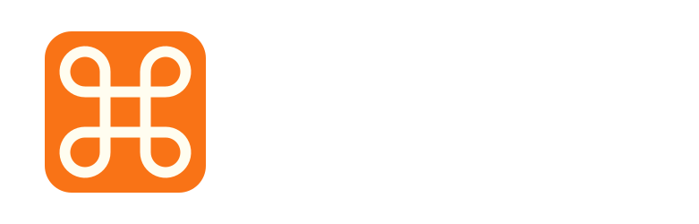
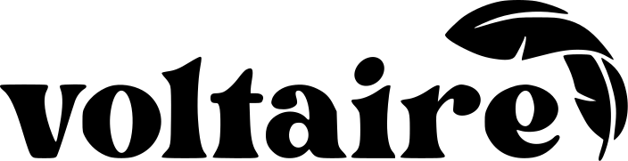
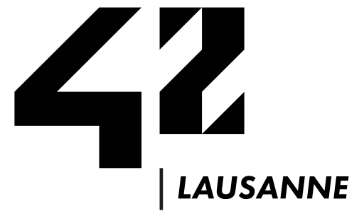
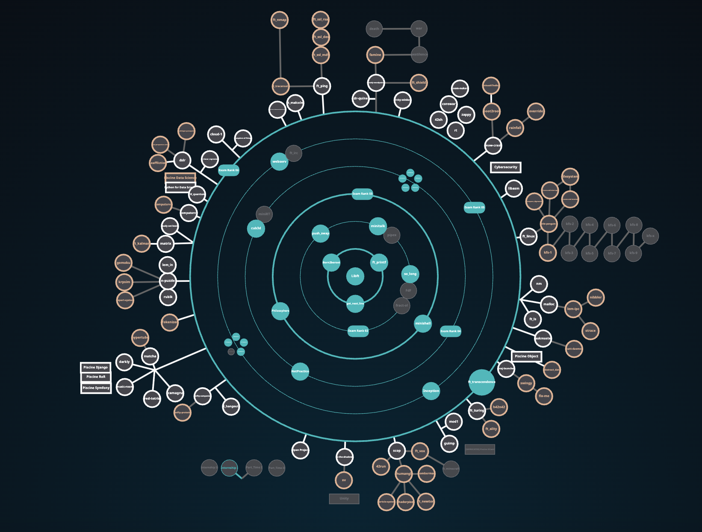

# Hi there! I'm Bima, or Tanguy 👋

I'm always looking for new ways to learn, collaborate, and create.
Let's explore my work and see what we can build together!

Wait, not so fast! I'll leave you with a brief summary of my current situation before going into more detail.

- 🎓 I'm still connected to the amazing [42 Lausanne School](https://42lausanne.ch/#temoignages) where learning never stops.
- 🪶 Writing [Voltaire AI](https://voltaire.chat/) and open source projects with [Widium](https://github.com/widium) and [Yvanoff](https://github.com/YvanoffP)
- 💻 Building AI-powered software and automating design workflows at [Labster](https://www.labster.io/).
- 🔗 You can find my professional journey and connect with me on [Linkedin](https://www.linkedin.com/in/tanguy-pauvret/)
- 📧 Drop me a line at <a href="mailto:contact@tanguypauvret.me">contact@tanguypauvret.me</a> I'm always up for a chat about tech, startups, or any other fascinating subject!

<!---->

## Side Projects Farm 🧑‍🌾

<table style="width: 100%; border-collapse: collapse; border-color: transparent">
  <tr>
  <td style="width: 50%; padding: 10px; text-align: center;">
    
  </td>
    <td style="width: 50%; padding: 10px; text-align: center;">
      
    </td>
  </tr>
  <tr>
      <td style="width: 50%; padding: 10px; text-align: center;">
        
      </td>
    <td style="width: 50%; padding: 10px; text-align: center;">
      
    </td>
  </tr>
</table>

## Where I Come From

It has been a wild ride. With a background in Neurosciences, I took a sharp turn into tech thanks to [42 Lausanne School](https://42lausanne.ch/#temoignages), driven by an insatiable curiosity and a knack for problem-solving.

<table style="width: 75%; margin-left: auto; margin-right: auto;">
  <tr>
    <td>
      
    </td>
    <td>
      
    </td>
  </tr>
</table>

The school is like Hogwarts for developers—minus the magic wands, but with a lot more coding. Here's how this unique environment helped me evolve:

- At 42, I didn't just learn to code; I learned to think like an innovator and quickly find a solution to a problem.
- The diverse projects helped me discover my passion for full-stack development and the thrill of startup life.
- Working with a community of motivated peers taught me the value of teamwork and how to collaborate effectively, even remotely and under tight deadlines.

 

## Open source projects

- #### [SaaS Boilerplate](https://github.com/Bima42/saas-boilerplate)
- #### [MCP Mem - Singapor Cursor Hackathon - Smithery Prize](https://github.com/Bima42/mcp-mem)
- #### [Healthspector - Hamburg Cursor Hackathon](https://github.com/Bima42/healthspector)
- #### [42 Projects](https://github.com/Bima42/42-projects-overview)
- #### [Maze generator](https://github.com/Bima42/cub3d_map_generator) for [42 Cub3D project](https://github.com/Bima42/cub3d)
